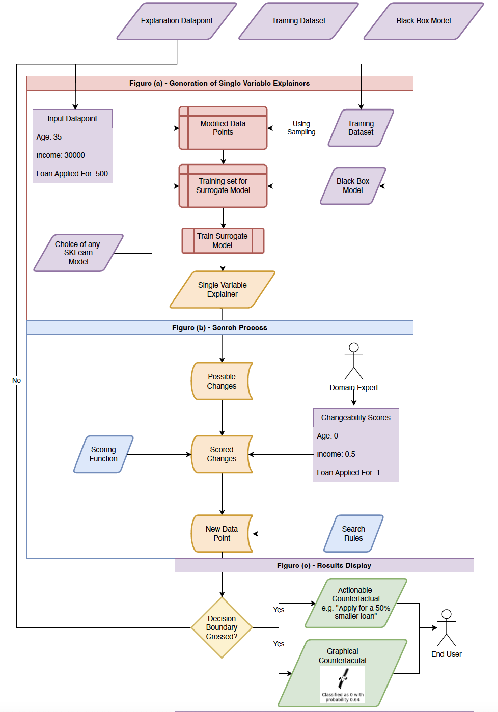

# TuneableCounterfactuals

## Introduction

A general purpose library for generating counterfactuals to explain the outputs of black-box Models


## Installation

```python
pip install -r requirements.txt
```

## Vignette

A simple example that uses our methodology to generate counterfactual explanations for a black box model.

```python
import sklearn

from sklearn.datasets import fetch_openml
from sklearn.model_selection import train_test_split
from sklearn.neural_network import MLPClassifier
from sklearn.pipeline import make_pipeline
from sklearn.preprocessing import StandardScaler

data = fetch_openml('mnist_784', parser='auto')
train_x, test_x, train_y, test_y = train_test_split(
    data.data[data.target.isin(['0', '1'])],
    data.target[data.target.isin(['0', '1'])], 
    test_size=0.2
)

model = MLPClassifier(hidden_layer_sizes=(200,200),alpha=1, max_iter=1000, solver='adam', verbose=10,  random_state=21,tol=0.000000001)
model = make_pipeline(StandardScaler(), model)
model.fit(train_x, train_y)

explainer = Explainer(
    model,
    train_x,
    'target',
    regressor='linear',
    bounding_method='minmax',
    override_variable_bounds=(0, 255)
)

result = explainer.explain(training_data.iloc[id], additional_threshold=0.25)
```

## Contact

Joshan Parmar

Soumya Banerjee (sb2333@cam.ac.uk)

## Citation

Forthcoming


## Graphical abstract

A graphical summary of our work is shown here




